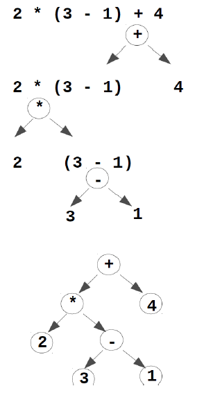

# Bäume

...nichtlineare Datenstrukturen für flexibles und effizientes Einfügen, Löschen und Suchen.

- oft zur hierarchischen Verwaltung von Daten
- können aus ähnlichen Grundelementen wie verkettete Listen aufgebaut werden
- in der Informatik geht es im Allgemeinen um markierte Bäume (Bäume dessen Knoten Werte zugeordnet sind), in deren Knoten Daten bzw. Datenstrukturen enthalten sind

## Grundbegriffe

| Begriff                      | Erklärung                                                                                                   |
|------------------------------|-------------------------------------------------------------------------------------------------------------|
| Tiefe des Knotens            | auch Ebene oder Niveaus des Knotens ist Länge des Weges von der Wurzel zu einem Knoten (Wurzel hat Tiefe 0) |
| Höhe des Baumes              | größte Knoten-Tiefe eines Baumes                                                                            |
| Marke                        | Wert, der einem Knoten eines Baumes zugeordnet ist                                                          |
| Markierter Baum              | Baum dessen Knoten Werte zugeordnet sind                                                                    |
| Eltern-/Vater(knoten)        | Vorgängerknoten eines Knoten                                                                                |
| Kind(knoten)                 | Nachfolger-Knoten eines Knoten                                                                              |
| Pfad/ Weg                    | Kantenfolge (Länge des Pfades/des Weges ist Anzahl der Kanten bzw. Anzahl der Knoten - 1)                   |
| Teilbaum                     | auch Unterbaum heißt jeder Teil eines Baums, der selbst ein Baum ist                                        |
| Blatt                        | Knoten ohne Nachfolger                                                                                      |
| Innere Knoten                | alle Knoten, die keine Blätter sind (Knoten mit Nachfolgerknoten)                                           |

## Bäume als spezielle Graphen

- gerichtete Graphen bestehen aus Knoten und Kanten
  - jede Kante führt von einem Vorgängerknoten zu einem Nachfolgerknoten
- Bäume sind spezielle Graphen
  - haben einen speziellen Knoten: "Wurzel"
  - außer Wurzel hat jeder Knoten genau einen Vorgängerknoten
  - von der Wurzel aus führt zu jedem Knoten genau eine Kantenfolge

## Darstellungsmöglichkeiten

## Traversierung

## Term-Bäume

...stellen Ausdrücke eindeutig dar, indem den Operatoren ihre Operanden explizit zugeordnet werden.

- Klammerung und Vorrang-Regeln werden durch Term-Bäume überflüssig

- Operatoren (Rechenzeichen) = Marke der inneren Knoten
- Operanden (Zahlen) zu Operator sind Teilbäume, die in Nachfolgerknoten (Kindknoten) beginnen
- Konstanten = Marke der Blätter

## Binäre Bäume
