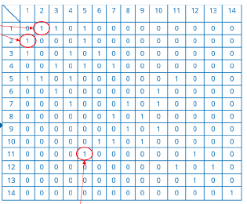

# Graphen

...bestehen aus einer Knotenmenge V (Vertex) und einer Kantenmenge E (Edge).

- Unterscheidung von gerichteter Graph und ungerichteter Graph
  - gerichteter Graph -> Graph G = (V,E); E echte Teilmenge von V x V
  - ungerichteter Graph -> Graph G = (V,E); E echte Teilmenge von P(V)
    - P(V) ist dabei alle 2-elementigen Teilmengen von V
  - in grafischen Darstellung erkennt man gerichteten- und ungerichteten Graphen daran, dass die Kanten des gerichteten Graphen durch Pfeilspitzen in eine Richtung zeigen, die Kanten des ungerichteten Graphen existieren dabei einfach zwischen den Knoten, ohne eine Richtung anzugeben

## Bezeichnung Kanten

- Kreis der Länge [xy]
- Knoten vom Grad [xy]
- Weg der Länge [xy]

## Anwendungsfälle für Graphen

| Graph               | Knoten            | Kante          |
|---------------------|-------------------|----------------|
| Kommunikation       | Computer, Telefon | Kabel          |
| Schaltkreise        | Prozessor         | Leitungen      |
| Finanzen            | Währungen         | Transaktionen  |
| Internet            | Server            | Verbindungen   |
| Spiel               | Brettstellung     | Zulässige Züge |
| Soziale Beziehungen | Person            | Freundschaften |

## Darstellung von Graphen

- Kanten-Menge
  - Angabe der Gesamtanzahl von Knoten und Kanten
  - zudem Angabe der Paarungen von Knoten, welche verbunden sind
  
- Matrix
  - Matrixschreibweise für Knoten
  - 2-dimensionales Knoten-zu-Knoten boolsches Feld bzw. Integer Feld (Integer bei Gewichtung) (= Adjazenzmatrix)
  - Zeilen- und Spaltenanzahl der Matrix = Anzahl der Knoten
  - boolsche Feld -> wenn Knoten miteinander verbunden sind, also eine Kante vorhanden ist, so _1_, wenn nicht, so _0_
  - siehe anhand Beispiel, dass identische Kanten in Matrix gespeichert werden
  
- Liste (Nachbarschaftsliste)
  - jeder Knoten enthält Liste von verbundenen Knoten (den Nachbarknoten)
  

## Minimum Spanning Tree (MST)

...oder auch Minimalgerüst oder Gerüst des kleinsten Wertes, ist ein Teilgraph eines ungerichteten Graphen, der ein Baum ist, der alle Knoten des Graphen enthält.

- Reminder zu Bäume...
  - Bäume sind spezielle Graphen
  - haben speziellen Knoten "Wurzel"
  - außer Wurzel hat jeder Knoten genau einen Vorgängerknoten
  - von Wurzel aus führt zu jedem Knoten genau eine Kantenfolge

- Charakteristisches eines MST...
  - ungerichteter Graph
  - Kanten gewichtet
  - MST ist Teilgraph eines ungerichteten Graphen mit minimalen Aufwand (Kanten mit geringsten Gewichtung)

  ## Zusammenfassung

- Graphen bestehen aus Knotenmenge V (Vertex) und Kantenmenge E (Edge)
- man unterscheidet gerichteten- und ungerichteten Graphen
- lassen sich unterschiedlich darstellen
  - Kanten-Menge (Angabe Gesamtanzahl Knoten, Kanten, Knotenpaare)
  - Matrix (Zeilen-, Spaltenanzahl Matrix = Knotenanzahl)
  - Liste (zu jeden Knoten Liste von Nachbarknoten vermerken)
- Minimum Spanning Tree (MST) = minimaler Teilgraph eines ungerichteten Graphen mit gewichteten Kanten, welcher einen Baum mit allen Knoten des Graphen darstellt
