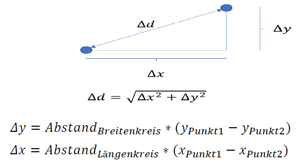

# Beispielumsetzung einer einfachen Wegfindung in Java

- beinhaltet
  - Klasse Node -> zur Verwaltung jedes einzelnen Nodes
  - Klasse Dijkstra -> Algorithmus
  - Klasse Tester -> dient zum Testen der Beispielumsetzung

## Prinzip



## Umsetzung

```java
/**
 * Verwaltet jeden einzelnen Node
 */

public class Node {

	private String name; //Name der Node
	private ArrayList<Node> nachbarn; //Liste der Nachbarn
	private Node vorgaenger; //Vorgaenger der Node
	private boolean startpunkt; //Angabe, ob Node Startpunkt
	private double x; //x-Koordinate der GPS-Koordinaten
	private double y; //y-Koordinate der GPS-Koordinaten
	private boolean besucht = false; //Angabe, ob bereits besucht

	public Node(String name, double x, double y, boolean startpunkt) {
		this.name = name;
		this.x = x;
		this.y = y;
		this.startpunkt = startpunkt;
		this.nachbarn = new ArrayList<Node>();
	}

	public void addNachbar(Node nachbar) {
		//gegenseitige Nachbarschaft hinzufuegen, wenn diese nicht bereits besteht
		if(!nachbarn.contains(nachbar)) {
			nachbarn.add(nachbar);
		}
		if(!nachbar.nachbarn.contains(this)) {
			nachbar.addNachbar(this);
		}
	}

	/**
	 * Berechnet Entfernung zweier Nodes mittels Satz des Pythagoras
	 *
	 * @param aktuellerNachbar
	 * @return
	 */
	public double berechneDistanz(Node aktuellerNachbar) {
		//Berechnung mittels Pythagoras		
		double dx = 71.5 * (x - aktuellerNachbar.x); //Konstante 71.5 ist Abstand von zwei Laengenkresen in Mitteleuropa
		double dy = 111.3 * (y - aktuellerNachbar.y); //Konstante 111.3 ist Abstand von zwei Breitenkreisen in Mitteleuropa
		return Math.sqrt(Math.pow(dx, 2) + Math.pow(dy, 2));
	}

	/**
	 * Berechnet Entfernung der Wegstrecke in km vom aktuellen Node zum Start-Node
	 *
	 * @return Wegstrecke von aktuellen Node zu Start-Node in km
	 */
	public double berechneEntfernung() {
		double entfernung = 0;
		if(vorgaenger != null) { //wenn Vorgaenger vorhanden
			entfernung += vorgaenger.berechneDistanz(this); //aktuelle Node - Vorgaenger Node
			double entfernungVorgaenger = vorgaenger.berechneEntfernung(); //Entfernung Vorgaenger bestimmen

			if(entfernungVorgaenger != -1) {
				entfernung += entfernungVorgaenger;
			} else {
				entfernung = entfernungVorgaenger;
			}
		} else if(!this.startpunkt) { //weder Vorgaenger noch Startpunkt
			entfernung = -1;
		} else { //es handelt sich um Startpunkt
			entfernung = 0;
		}
		return entfernung;
	}

	/**
	 * Vergleicht die Nodes ueber die Differenz der Entfernung,
	 * zum Sortieren der Knoten nach Abstand
	 *
	 * @param o
	 * @return
	 */
	public int compareTo(Node o) {
		Node k = o;
		double diff = this.berechneEntfernung() - k.berechneEntfernung();
		if(diff == 0) {
			return 0;
		} else if(diff > 0) {
			return 1;
		} else {
			return -1;
		}
	}

	public void setBesucht() {
		besucht = true;
	}

	public boolean getBesucht() {
		return besucht;
	}

	public ArrayList<Node> getNachbarn() {
		return nachbarn;
	}

	public Node getVorgaenger() {
		return vorgaenger;
	}

	public void setVorgaenger(Node vorgaenger) {
		this.vorgaenger = vorgaenger;
	}

	public String getName() {
		return this.name;
	}
}
```
