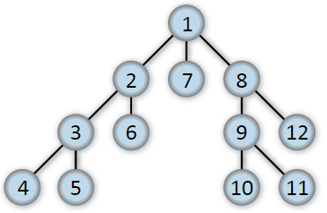
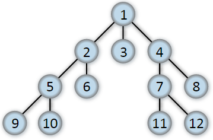

# Tiefen- und Breitensuche durch eine Graphen im Vergleich

...basierend auf [Beitrag auf Techie Delight](https://www.techiedelight.com/de/depth-first-search-dfs-vs-breadth-first-search-bfs/) sowie der dort verwendeten Übersichten und Diagramme.

| Tiefensuche                                                    | Breitensuche                                                   |
|----------------------------------------------------------------|----------------------------------------------------------------|
| beginnt an Wurzel des Baums oder beliebigen Knoten für Graphen | beginnt an Wurzel des Baums oder beliebigen Knoten für Graphen |
| wird so weit wie möglich entlang jedes Zweigs untersucht       | untersucht zuerst Nachbarknoten, bevor zu Nachbarn der nächsten Ebene übergangen wird |
| benötigt keine zusätzliche Datenstruktur zum Speichern der Baum-/Graphknoten | benötigt separate Datenstruktur zum Verfolgen der noch zu besuchenden Baum-/Graphknoten |
| wird rekursiv implementiert und verwendet Call-Stack                         | Verfolgung geschieht iterativ mit Queuen-Datenstruktur                                  |
| Speicherbedarf abhängig von Struktur Baums/Graphens, jedoch maximaler Speicher = Tiefe des Baums | Speicherbedarf ebenfalls abhängig von Struktur des Baums/Graphen, jedoch maximaler Speicher = Breite des Baums |
| findet Weg,  falls ein Weg existiert                           | findet optimalen Weg, falls ein Weg existiert                  |

Reihenfolge Tiefensuche\

- für bspw.
  - Zusammenhängende Komponenten in einem Graphen finden
  - finden von stark verbundenen Komponenten in einem Graphen
  - Rätsel lösen mit nur einer Lösung (wie Labyrinth)

Reihenfolge Breitensuche\

- für bspw.
  - Suche nach kürzesten Weg zwischen zwei Knoten
  - MST (Minimum Spanning Tree = Minimaler Spannbaum) für ungewichtete Graphen ermitteln
  - De-/Serialisierung binärer Bäume

## Zusammenfassung

- Tiefensuche: Baum/Graph wird zuerst in Tiefe abgesucht -> findet Weg, falls ein Weg existiert
- Breitensuche: Baum/Graph wird zuerst in Breite abgesucht, bevor es in Tiefe weitergeht -> findet optimalen Weg, falls ein Weg existiert
- Tiefensuche verwenden
  - wenn man im Voraus weiß, dass Lösung irgendwo tief in einem Baum oder weit entfernt vom Quellscheitelpunkt im Diagramm liegt
  - man weiß, dass Baum sehr breit ist -> benötigt in diesem Fall weniger Speicher als Breitensuche, da maximaler Speicherbedarf bei Tiefensuche = Tiefe des Baumes
- Breitensuche verwenden
  - wenn man im Voraus weiß, dass Lösung nicht so weit vom Quellknoten entfernt ist
  - wenn man weiß, dass Baum besonders tief ist -> benötigt in diesem Fall weniger Speicher als Tiefensuche, da maximaler Speicherbedarf bei Breitensuche = Breite des Baums
